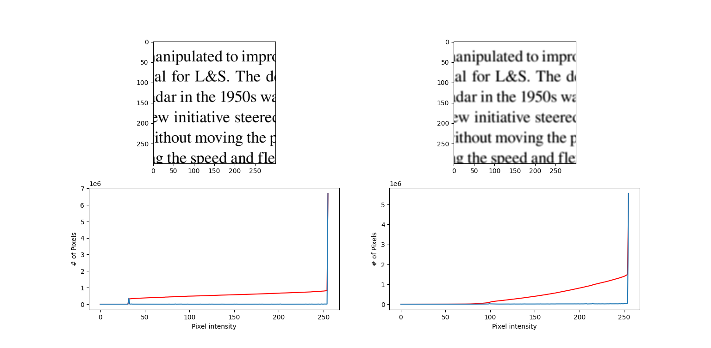
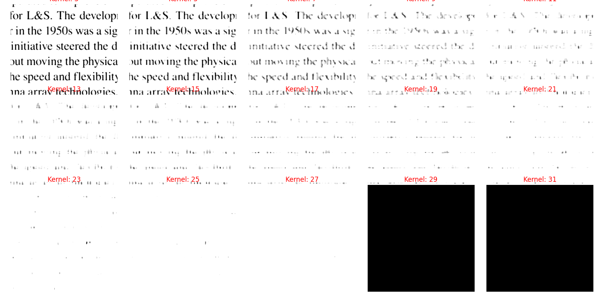
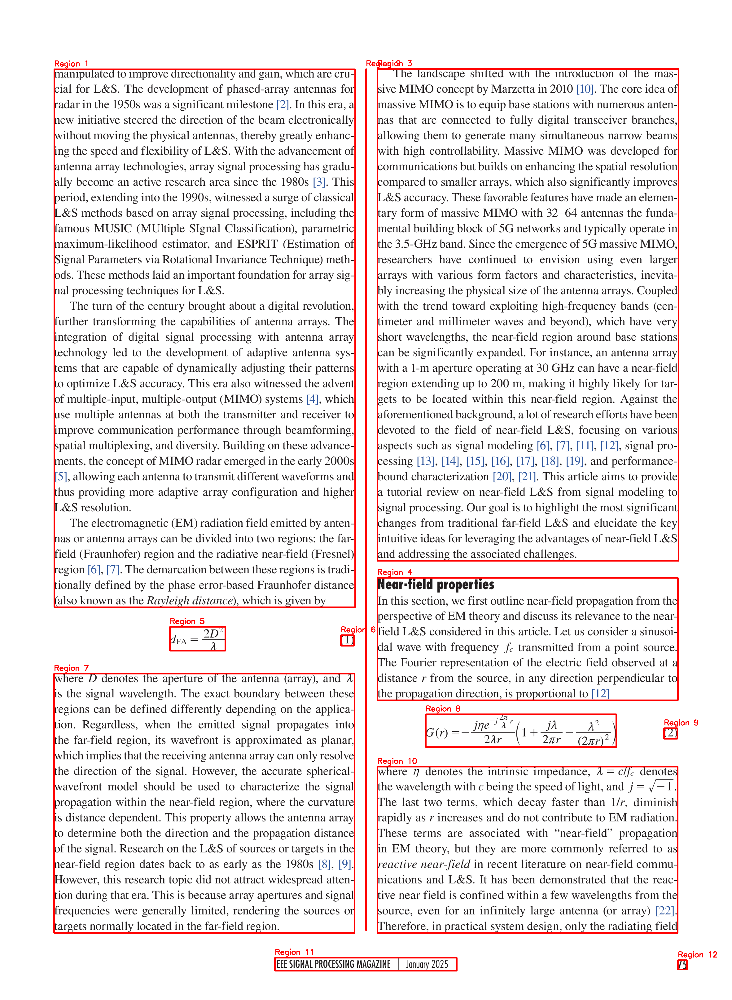
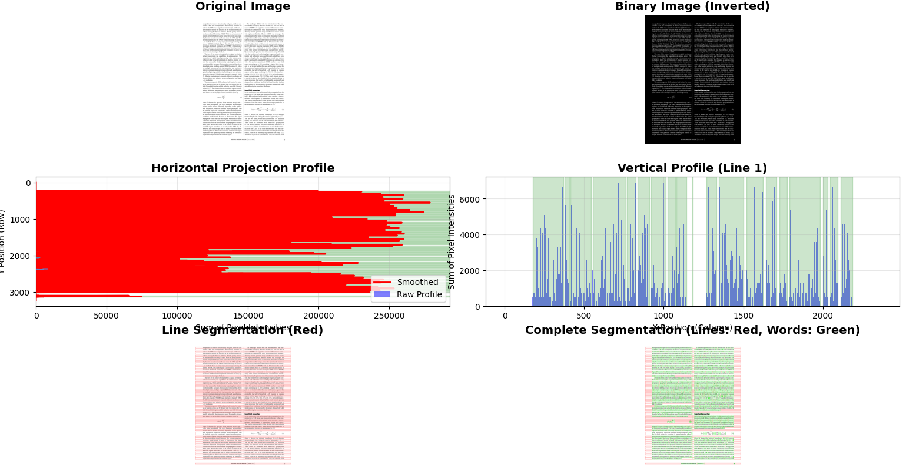

# Computer Vision

A collection of computer vision assignments covering image processing, panoramic stitching, image classification, and deep learning — implemented in Python using OpenCV, Keras, and TensorFlow.

## Assignments

| # | Topic | Report | Key Techniques |
|---|-------|--------|----------------|
| [1](1/) | Image Processing & Noise Removal | [Report (PDF)](1/Report.pdf) | Median/Gaussian filtering, Salt & Pepper noise, Integral images, Projection profiling, Text segmentation |
| [2](2/) | Panoramic Image Stitching | [Report (PDF)](2/Report.pdf) | SIFT/SURF/ORB feature detection, Homography, BFMatcher, Planar/Cylindrical/Hybrid stitching |
| [3](3/) | Image Classification (BoVW & SVM) | [Report (PDF)](3/Report.pdf) | Bag of Visual Words, SIFT descriptors, SVM classification, KNN, Caltech & GTSRB datasets |
| [4](4/) | Deep Learning for Image Classification | [Report (PDF)](4/58105.pdf) | CNN, Keras, TensorFlow, Transfer Learning |

---

## Repository Structure

```
computer_vision/
├── 1/                          # Assignment 1: Image Processing
│   ├── generate.py             # Generate noisy images
│   ├── noise_free.py           # Noise-free image processing & text segmentation
│   ├── noise_gaussian.py       # Gaussian noise analysis
│   ├── noise_salt_and_pepper.py# Salt & pepper noise analysis
│   ├── Src/                    # Source modules
│   │   ├── filters.py          #   Custom median & Gaussian filters
│   │   ├── helper_functions.py #   Display utilities
│   │   ├── integral.py         #   Integral image computation
│   │   ├── noise.py            #   Noise generation functions
│   │   ├── projection_profiling.py # Horizontal/vertical projection
│   │   └── version.py
│   ├── Images/                 # Input & noisy images
│   └── Report/                 # Figures used in report
│       ├── gaussian/
│       ├── salt_n_pepper/
│       ├── projection/
│       └── text_segmentation/
│
├── 2/                          # Assignment 2: Panoramic Stitching
│   ├── main.py                 # Stitching pipeline entry point
│   ├── camera_params.yaml      # Camera calibration parameters
│   ├── src/
│   │   ├── answers/
│   │   │   ├── bfmatcher.py    #   Feature matching & homography
│   │   │   ├── image_operations.py # Image transformations
│   │   │   └── stitch/
│   │   │       ├── stitch_planar.py      # Planar stitching
│   │   │       ├── stitch_cylindrical.py # Cylindrical projection stitching
│   │   │       └── stitch_hybrid.py      # Hybrid stitching approach
│   │   └── helper/
│   │       ├── calibration_main.py
│   │       └── io.py
│   ├── calibrate/              # Camera calibration data
│   └── out/                    # Stitched panorama outputs
│
├── 3/                          # Assignment 3: Image Classification
│   ├── A.py                    # BoVW + SVM / KNN pipeline
│   ├── B_caltech.ipynb         # Caltech dataset analysis notebook
│   ├── B_gtsrb.ipynb           # GTSRB dataset analysis notebook
│   ├── Dataset 1/              # Caltech-Transportation dataset
│   ├── Dataset 2/              # GTSRB dataset
│   └── Data/                   # Pre-computed features (npy)
│
├── 4/                          # Assignment 4: Deep Learning
│   └── HW4_58105.ipynb         # CNN classification notebook
│
├── LICENSE                     # MIT License
└── README.md                   # This file
```

---

## Getting Started

### Prerequisites

- Python 3.8+
- OpenCV (with `opencv-contrib-python` for SIFT/SURF)
- NumPy, Matplotlib
- Keras, TensorFlow (for Assignment 4)
- Jupyter Notebook (for `.ipynb` files)

### Installation

```bash
git clone https://github.com/ZwPwn/computer_vision.git
cd computer_vision
pip install -r requirements.txt
```

### Running

Each assignment is self-contained in its numbered directory:

```bash
# Assignment 1 — Image Processing
cd 1/
python generate.py          # Generate noisy images
python noise_free.py        # Run text segmentation pipeline
python noise_gaussian.py    # Analyze Gaussian noise removal
python noise_salt_and_pepper.py  # Analyze Salt & Pepper noise removal

# Assignment 2 — Panoramic Stitching
cd 2/
python main.py              # Run stitching pipeline

# Assignment 3 — Image Classification
cd 3/
python A.py                 # Run BoVW + SVM/KNN classification

# Assignment 4 — Deep Learning
# Open 4/HW4_58105.ipynb in Jupyter Notebook
```

---

## Reports

Each assignment includes a detailed PDF report with methodology, results, and analysis:

- **Assignment 1** — [Report.pdf](1/Report.pdf): Filtering techniques, noise analysis, projection profiling, text segmentation
- **Assignment 2** — [Report.pdf](2/Report.pdf): Feature detection comparison (SIFT/SURF/ORB), panoramic stitching methods
- **Assignment 3** — [Report.pdf](3/Report.pdf): Bag of Visual Words, SVM vs KNN classification on transportation and traffic sign datasets
- **Assignment 4** — [Report.pdf](4/58105.pdf): Deep learning-based image classification using CNNs

### Sample Results

<details>
<summary>Assignment 1 — Noise Removal & Text Segmentation</summary>

| Gaussian Filtering | Salt & Pepper Removal | Text Segmentation |
|---|---|---|
|  |  |  |

**Projection Profiling:**



</details>

<details>
<summary>Assignment 2 — Panoramic Stitching</summary>

Outputs are located in [`2/out/`](2/out/) with results for multiple datasets and feature detection algorithms.

</details>

---

## License

This project is licensed under the MIT License — see [LICENSE](LICENSE) for details.

---

## Author

**Grammenos-Georgios Polymeridis**  
Democritus University of Thrace — MSc Electrical & Computer Engineering  
[GitHub](https://github.com/ZwPwn) · [Email](mailto:grampoly@ee.duth.gr)
